# 🛳️ The Titanic is Sinking... Let's Save It.

## 📖 The Story
We are building the Titanic. We want it elegant, we want it beautiful, and we are fusing classic ship aesthetics with vibrant, high-energy EDM coloring and algorithmic pixel art. 

But this isn't just a static installation. The story is that the Titanic is sinking—and we are inviting the playa to step up and save it. Through interactive controls, live DJ takeovers, and a massive integrated lighting ecosystem, participants can literally grab the wheel and alter the fate of the ship. We are building an experiential art sculpture for all aliens. 

Here is how the engine room works, what we’ve built, and where we need your brilliant minds to help us lock it all in.

---

## 🎨 Artistic Theme & Presence
While the technology is complex, the visual impact must be organic. We want the Titanic to maintain a **calm, organic presence** on the playa. 

This thematic focus guides how we design our algorithmic pixel art and lighting choreography. Our lights must fulfill three distinct roles:
1. **Calm Proximity:** Emitting a serene, inviting presence for participants interacting closely in the auditorium (around the Titanic boxes).
2. **Bold Distance:** Remaining bright and distinct enough to be a beacon instantly recognizable from deep playa.
3. **Harmonic Synergy:** Synchronizing the high-tech LED arrays organically with physical fire elements.

This calm baseline makes dynamic shifts incredibly powerful. We can design dramatic, high-energy impact scenes that are selectively triggered—either globally based on the time of night, or initiated by external events like a participant grabbing the wheel at the Control Podium.

---

## 🌌 The Simulation Stack & Pixel Blaze Setup
At the core of the project is a massive, custom **3D Simulation Stack**. We aren't just blindly writing DMX values; we are rendering perfect ;) digital twin of the Titanic and every light on it.

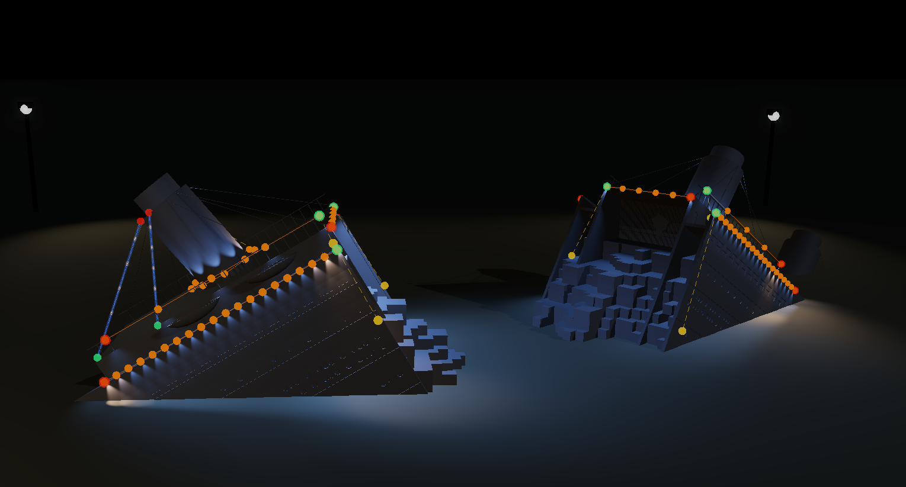

* **The Digital Twin:** We can easily instantiate new fixtures, orient them on the 3D ship, and map millions of pixels. The model supports addressing isolated subsections (e.g., "Left Wing," "Right Wing") or treating the entire ship as one unified 3D canvas.
* **Pixel Blaze Runtime:** The simulation hosts a native Pixel Blaze environment. This allows us to run beautiful, generative pixel-art shows 24/7 for the whole week with zero manual interaction needed. Think of this as screen saver for Chromatik. And if chromatik is on, this can be silenced.
* **The Layering Mixer (Coming Soon):** We are currently building a mixer to run multiple Pixel Blaze patterns simultaneously, routing them to different channels and blending them across the hull.

### 📸 Render Galleries
Here are the latest structural and lighting renders highlighting our different scenes and perspectives:
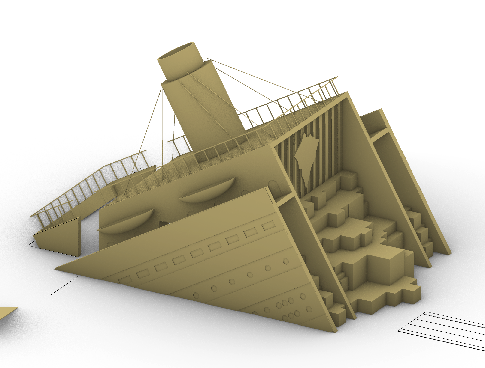

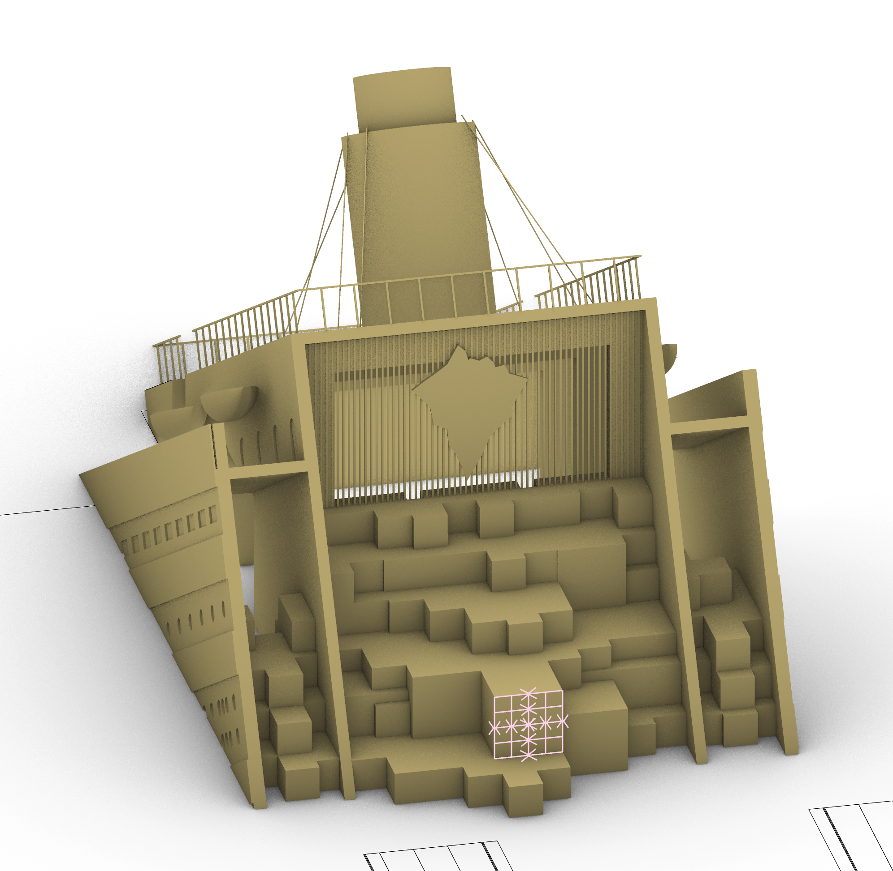
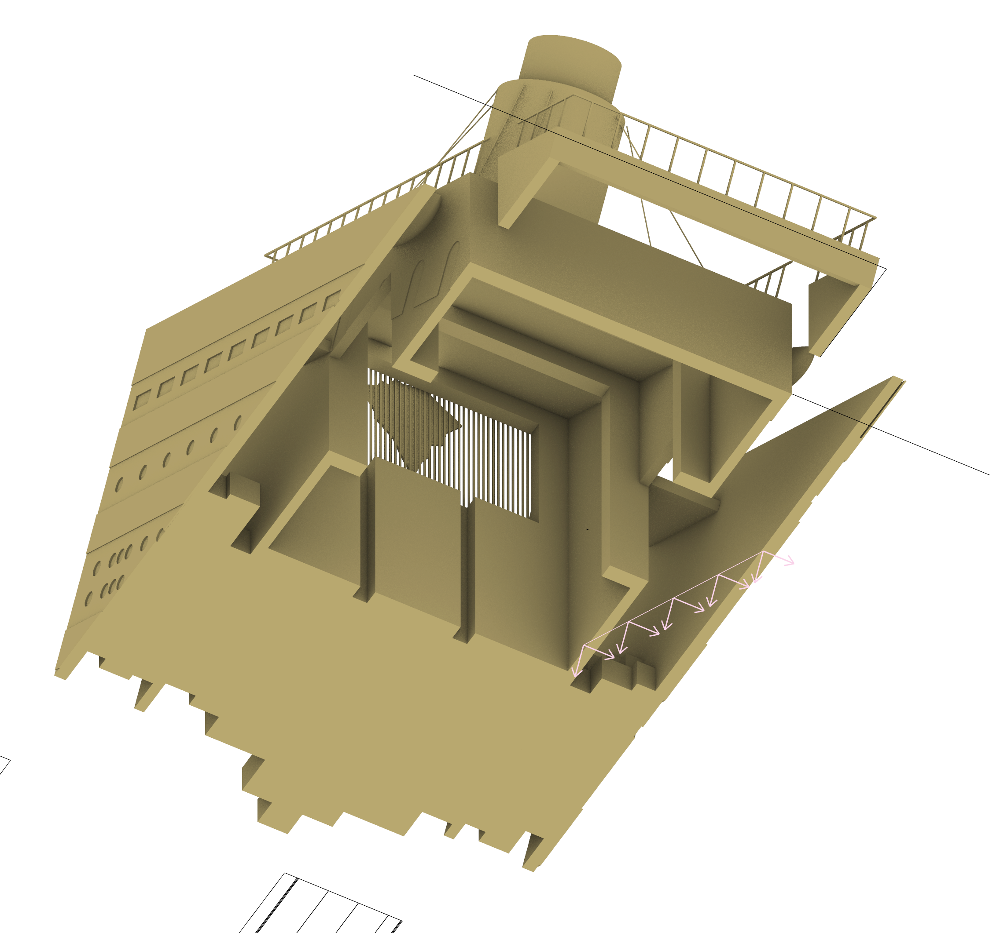

## 💡 The Fixtures & Advanced DMX Engine
We are pushing far beyond standard RGB. 

* **6-Channel Depth:** Every pixel on our custom DMX fixtures leverages 6 distinct values: **Red, Green, Blue, Amber, White, and UV (Purple)**. 
* **1:1 Native Mapping:** Where physical LEDs are mapped into our 3D space. Using a custom 3D software we created, we models the DMX fixtures in 3D space so the simulator knows exactly where every bulb is in physical space.

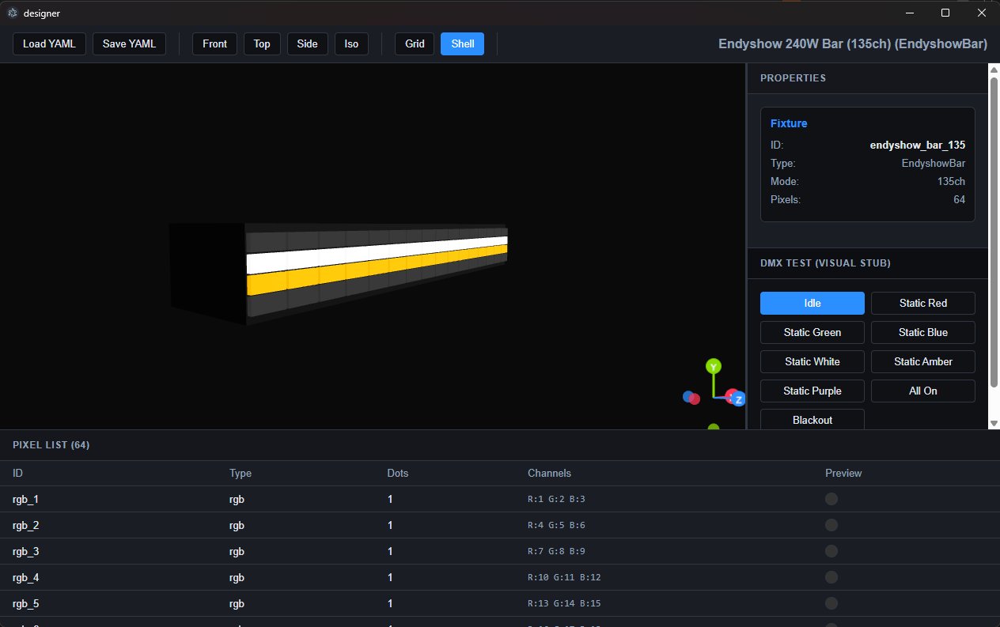

* **Selected DMX Fixtures:** So far we’ve dialed in on these primary units:
  * 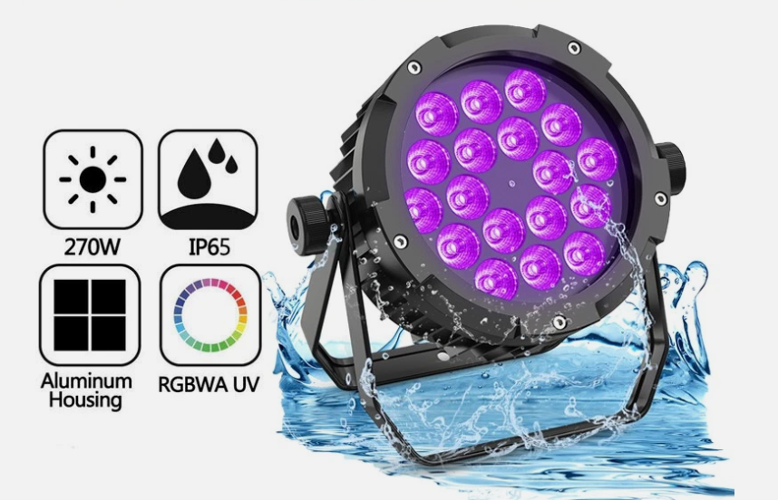
  * 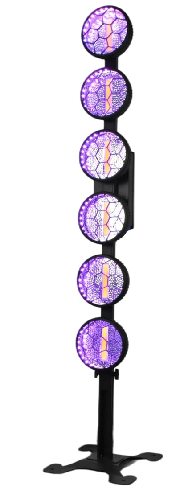
  * 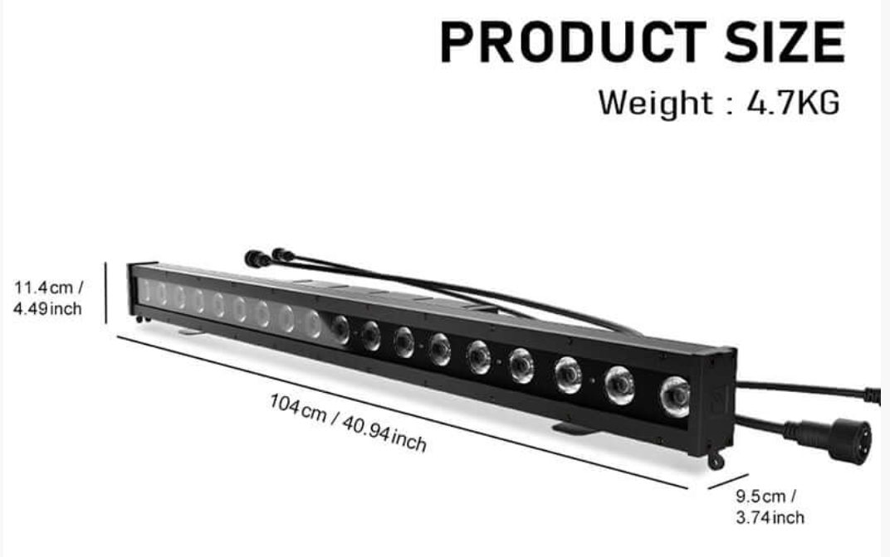 *(Note: LED light bars haven't arrived yet, so exact specs are TBD).*
* **Dumb White LEDs:** For functional lighting (safety around the playa, structural outlines, or simulating the iceberg itself), we are also incorporating these basic LED strips:
  * 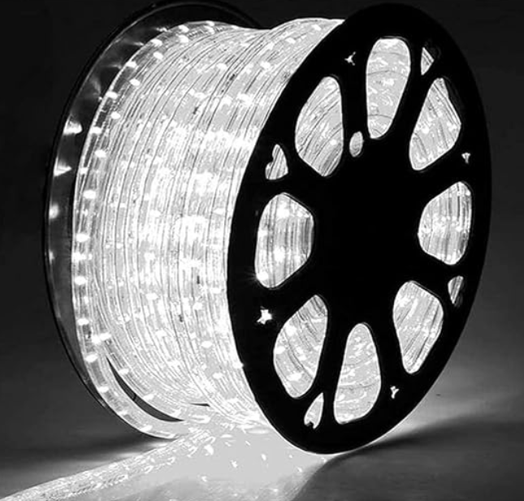
* **Art-Net Backbone:** We are utilizing PKnight Art-Net controllers pushing 1 to 8 universes. A single data line hits the first fixture of a group, and the rest daisy-chain seamlessly in series.
  * 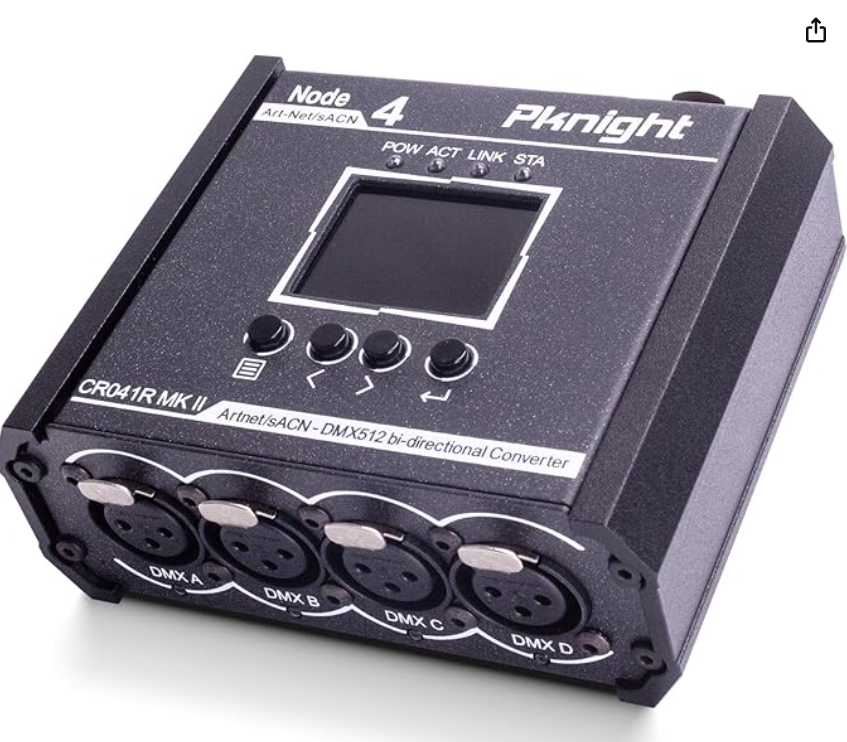
* Can support auto export to Chromatik.

## 🛠️ Hardware Rigging & The "Playa-Ready" Installation
We need this to go up and come down in a matter of hours. "Touch-and-leave" is the goal.

* **Pre-installed Clusters:** We are designing systems where fixtures (e.g., 4 PARs or 2 Bars) are pre-mounted to a central spine.
* **Pipes vs. Steel Wire:** We initially considered rigid metal pipes, but we are pivoting to experiment with thick steel wire to hoist them high. It's lighter, absorbs wind better, and offers more flexibility. **[Action Item: We need ideas here to help lock in this rigging design!]**
* **Transport & Storage:** Logistics on the playa are everything. We are looking at these carry cases as viable storage options for the LED bars. We must think deeply about transportation and rapid unpacking.
  * 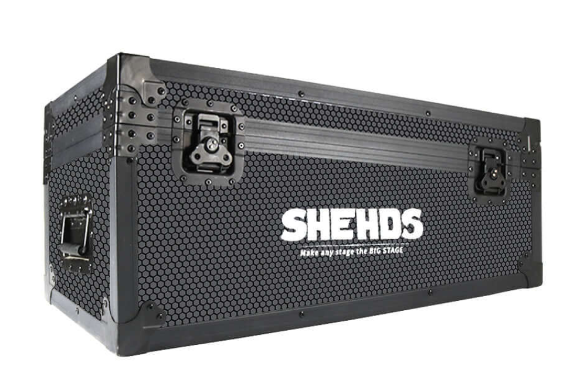
* **Smoke Stack Guy Ropes:** We need to design and fabricate a custom set of LED rope fixtures to run down the massive guy ropes anchoring the smoke stacks. 

## 🔭 The Control Podium & Companion Apps
In parallel, we are building a completely standalone remote podium located physically away from the ship, along with an ecosystem of mobile apps for the core team.

* **A VJ Setup for a 5-Year-Old:** The podium features binoculars aimed directly at the Titanic. When a participant looks through, they are presented with a massive, intuitive control panel. 
* **Save the Ship:** Pushing buttons and turning dials on the podium will directly hijack the ship's lighting state. The exact interaction mechanics are up for debate, but the infrastructure is ready.
* **Companion Apps & Mobile Fleet:** We aren't just bound to the podium. Our core team can connect their personal phones to one of our wireless controllers via BLE. That controller then injects them into the Titanic's custom LoRa mesh network. From their phone, anyone with a paired controller can view system health, change lighting scenes, or trigger full blackouts on the fly.

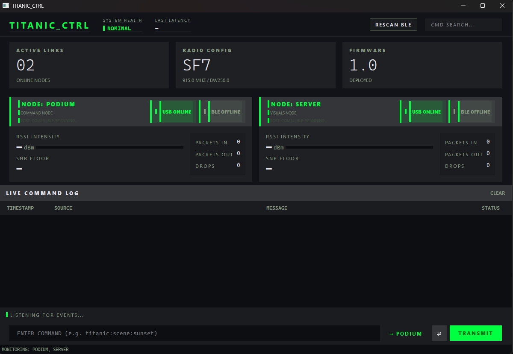

## 🎉 Party Night: The Live Takeover
The system is built to survive independently, but thrive when driven live.

* **The Failsafe:** The Pixel Blaze VM is the heartbeat. If no one is at the helm, the ship is still actively putting on a gorgeous show.
* **The Override:** We’ve designed the network so that top-tier VJs (like Alex or Chromatic) can seamlessly hijack the rig. 
* **The Network:** We run a hardwired Ethernet line out of the server room to a localized switch. From there:
  * A machine running **Resolume** can take over interactive video and projection mapping.
  * A machine running **Chromatic** can take over the raw DMX output for a live DJ party night.

## 🖥️ The Engine Room
The brain of the ship is hidden in plain sight.

* **The Cabinet:** We are integrating a stealth cabinet door directly into the Titanic's architectural design.
* **The Server:** Inside lives the main workstation running the heavy simulation and Pixel Blaze environments, complete with a monitor and KVM setup for on-site debugging.
* **The Heart:** All Power, Ethernet, and DMX runs originate here, passing through local switches before spidering out to the rest of the ship.

---
**The ship is sinking. We have the blueprint, we have the engine, and we have the vision. Now we need the crew. Let's build this.**
